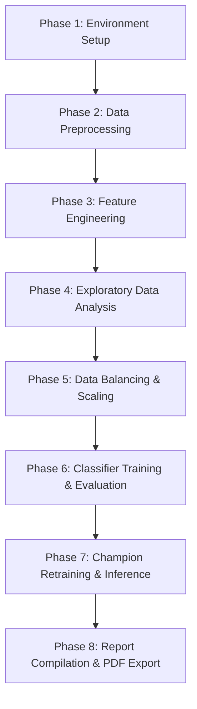

# Credit Card Behaviour Score Prediction (ccp_finclub)

This repository contains the complete end-to-end pipeline for predicting credit card default probabilities using classification and risk-based modeling. The project covers data preprocessing, feature engineering of behavioral risk indicators, class balancing, model training/evaluation, and automated PDF report generation.

---

## 1. Project Directory Structure

```
├── ccp_finclub.ipynb          # Enhanced Jupyter Notebook with LaTeX & inferences
├── train_dataset_final1.csv   # Historical training dataset
├── validate_dataset_final.csv # Unlabeled validation dataset for final predictions
├── final_report.md            # Detailed Markdown report (relative links for VS Code)
├── report.pdf                 # Executive-ready printed PDF report
├── README.md                  # Project README (this document)
├── submission_23117052.csv    # Final default predictions output on validate dataset
└── *.png                      # High-resolution charts embedded in reports
```

---

## 2. Technical Stack & Libraries Used

The pipeline is implemented in **Python 3** and leverages the following key libraries:

### Data Manipulation & Core Mathematics
*   **`numpy`**: Used for fast numerical vector operations, calculating standard deviations, and clipping credit utilization values between 0 and 1.5 to handle extreme outliers.
*   **`pandas`**: The backbone for loading CSV datasets, cleaning missing data (`dropna()`), structuring features, splitting variables, and exporting the final prediction submission.

### Data Visualization
*   **`matplotlib.pyplot`**: Used to configure figure sizes, axes labels, title structures, tight layouts, and save high-resolution PNG charts.
*   **`seaborn`**: Built on matplotlib, used to generate stylized box plots, stacked histograms, count plots, and a customized correlation heatmap.

### Machine Learning & Preprocessing (Scikit-Learn & Imbalanced-Learn)
*   **`sklearn.model_selection.train_test_split`**: Splits the historical dataset into stratified training (80%) and validation (20%) subsets.
*   **`sklearn.preprocessing.StandardScaler`**: Scales features to zero mean and unit variance ($z = (x - \mu)/\sigma$), preventing high-scale values from dominating model gradients.
*   **`imblearn.over_sampling.SMOTE`**: Applies Synthetic Minority Over-sampling Technique to balance the default/no-default classes in the training partition.
*   **`sklearn.metrics`**: Implements critical metrics used to assess credit risk performance, including:
    *   `accuracy_score` (Accuracy)
    *   `recall_score` (Recall / Sensitivity)
    *   `f1_score` (F1-score)
    *   `fbeta_score` (F2-score with beta=2)
    *   `roc_auc_score` (Area Under the ROC Curve)
*   **`sklearn.linear_model.LogisticRegression`**: Baseline linear classifier using L2 (Ridge) regularization.
*   **`sklearn.tree.DecisionTreeClassifier`**: Champion model used to build a depth-controlled tree based on Gini Impurity.
*   **`sklearn.ensemble.RandomForestClassifier`**: Bootstrap Aggregation (Bagging) ensemble of decision trees.
*   **`xgboost.XGBClassifier`**: Extreme Gradient Boosting classifier optimized via regularized tree complexity.
*   **`shap`**: Model-agnostic explainer used for analyzing feature importance via SHAP values.

### Report Compiling & Publishing
*   **`markdown`**: Python library used to parse `report.md` text and convert it to standard HTML.
*   **`xhtml2pdf`**: Converts styled HTML and CSS templates into printed PDF format (`report.pdf`), resolving relative image references and preventing page overflow.

---

## 3. Detailed Flow of Execution

The pipeline executes sequentially in eight distinct phases:



### Phase 1: Environment Setup & Data Loading
1.  Python libraries are imported.
2.  The historical dataset (`train_dataset_final1.csv`) and validation dataset (`validate_dataset_final.csv`) are loaded into Pandas DataFrames.
3.  Rows containing missing values (`NaN`) are identified and dropped using `.dropna()`.

### Phase 2: Preprocessing & Target Variable Exploration
1.  The target variable `next_month_default` ($0$ = No Default, $1$ = Default) is analyzed.
2.  Class distribution is plotted, confirming a **78% / 22% class imbalance** (No Default vs. Default).

### Phase 3: Feature Engineering of Risk Indicators
To capture recent transaction dynamics, six behavioral risk metrics are computed:
1.  **Credit Utilization Ratio**: Ratio of average bill amount to credit limit, capped at $1.5$.
2.  **Delinquency Count**: Total number of months with delayed payments ($k \ge 1$) across the 6-month window.
3.  **Max Payment Delay**: The longest overdue period (in months) observed in the history.
4.  **Average Delay**: Mean payment status value across the 6-month period.
5.  **Repayment Consistency**: Coefficient of variation of payment amounts (standard deviation divided by mean payment + 1) measuring volatility.
6.  **Payment-to-Bill Ratio**: Total payment amount divided by total bill statement amount (+ 1).

### Phase 4: Exploratory Data Analysis (EDA)
1.  Bivariate boxplots and histograms are plotted for all engineered features against the target `next_month_default`.
2.  A correlation matrix is generated for numeric features. This reveals severe multicollinearity among the statement amounts (`Bill_amt1` to `Bill_amt6`), highlighting that tree-based algorithms or regularized linear models are required.
3.  All generated plots are saved as PNG files.

### Phase 5: Data Balancing & Scaling
1.  The features are split into training (80%) and validation (20%) sets using stratified splitting to preserve default ratios.
2.  **SMOTE** is applied to the training split. It generates synthetic minority instances by interpolating between nearest neighbors:
    $$x_{new} = x_i + \lambda (x_{zi} - x_i) \quad \text{where } \lambda \sim U(0,1)$$
3.  A **StandardScaler** is fitted on the balanced training split and used to transform both the training and validation features to ensure unit variance.

### Phase 6: Classifier Training & Evaluation
1.  Four models are initialized: Logistic Regression, Random Forest, Decision Tree, and XGBoost.
2.  Models are fitted on the balanced, scaled training set.
3.  Probabilities are predicted, and a **risk-averse classification threshold of 0.3** is applied.
4.  The models are evaluated using stratified metrics, prioritizing **Recall** and **F2-Score** (which weights Recall twice as heavily as Precision to penalize False Negatives).
5.  Performance results are compiled, revealing that **Decision Tree Classifier** generalizes best, achieving a validation Recall of **73.15%** and an F2-Score of **0.5740** without showing the severe overfitting seen in Random Forest (which had 100% training Recall).

### Phase 7: Champion Retraining & Final Predictions
1.  The champion model (**Decision Tree Classifier** with `max_depth=6`) is retrained on the entire balanced historical dataset.
2.  Predictions are generated on the scaled validation dataset (`validate_dataset_final.csv`) using the 0.3 threshold.
3.  A submission file (`submission_23117052.csv`) is generated containing the customer IDs and predicted default flags.

### Phase 8: Report Compilation & PDF Export
1.  The markdown report `report.md` is structured, referencing the saved PNG charts with relative paths.
2.  A Python compiler script (`convert_to_pdf.py`) converts the Markdown report into a rendered HTML page and exports it as `report.pdf` using `xhtml2pdf`, applying page-break CSS controls to prevent visual splits.
